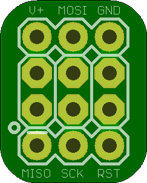

## Avr ZIFF Programmer

This simple utilitarian board makes use of a Ziff Socket and AVR ICSP headers to enable the programming of four different

* ATtiny85
* ATtiny84
* ATtiny2313
* ATmega328

It also has a FTDI adapter that works with the ATmega328

very handy for flashing a bunch of chips to put in kits. 

You can 

## AvrZiffProgrammer 

### Board dimensions

* (240000, 129997) original units
* (2.4000, 1.3000) inches
* (60.9600, 33.0192) mm

| Front | Back |
| --- | --- |
|  |  |

## Breadboard_ICSP 

### Board dimensions

* (40000, 50000) original units
* (0.4000, 0.5000) inches
* (10.1600, 12.7000) mm

| Front | Back |
| --- | --- |
|  |  |

